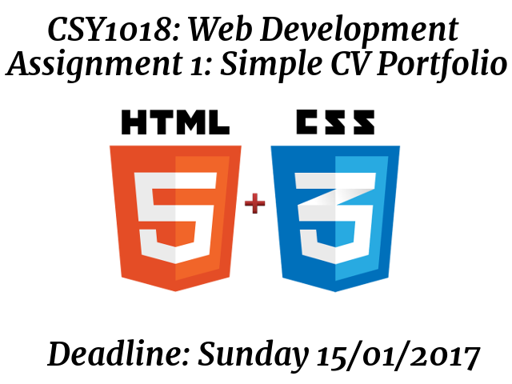

# CSY1018_assignment1

## Cover 

Name: Kitsantas Fotios    
Student ID: 17421808    
GitHub Repository: https://github.com/fkitsantas/CSY1018_assignment1    
Website Link (on GitHub): https://fkitsantas.github.io/CSY1018_assignment1/    

## Abstract

On this assignment our goal is to design and develop a Personal Webpage that consists of a 'starter' personal portfolio to support our future employability with the strictly use of HTML5 and CSS, while working our website on a simple text editor.

## Analysis

The way I implemented my website was done on steps.        

Started by declaring the "Header" section of my page. The static content i need it to have on top of every page.
I include there the code for the music as it's not an element that will appear on page and I consider it as part of the header page.
However, this could be placed anywhere on the HTML file.

The Audio file (mp3) that I used is an Unlicensed mp3 (bensound-rumble.mp3) that i downloaded from
http://http://www.bensound.com/ . I put this on my page as a background music with the use of the default
HTML5 player and the attributes of autoplay in order to start on the background automatically during the time
that it takes for my page to load fully, plus loop in order to play nonstop (for those who enjoy the specific song).
I did use the ID of "bg_music" on the <audio> tag because I am planning to put some extra effort if  
there is time and give the use the ability to pause/stop the music with some buttons somewhere on site.
For now, since there are no buttons either, I have the "hidden" in order to just make it invisible on
page.

I use the IMG html tag, with the characteristics of the class "logo" in order to set an image on the
top of my page as the logo of my website, and in order to make it look more like a "website logo" i created
an IMG class named as "logo" on my CSS and added few cool characteristics as the "border-radius: 50%;" so that
it adds that circle cut effect (that could alternativly do on an Image Editor and save the "around the circle"
area as a transparent background. I also added the position relative attribute in order to be able to use a 2nd
CSS rule and put a text (as a Welcome text in the beggining, then changed my mind and replaced it with just a
"website title"). I did this because i wanted to achieve to put the text ON TOP of the image in order to make it 
look like a real website logo.

Text added on a \
 class logo, styled with some characteristics to make it look more like a logo, and placed above the image
that I use as my webpage's logo. I also used a font from "Google Fonts" in order to make it look a bit better.

I created my website's Navigation Bar as a list of elements (that work as links), then I make it act as a
Navigation Bar for my website by the use of CSS styles to make them arrange on the same raw with a specific appereance.
i set the ID of this to nav, so everything on this unordered list is going to get characteristics from the specific
styleset that I created for "nav" on my CSS file.

I am Listing my Links one by one on as linked elements in order to create my Navigation bar. Styling was taken from W3Schools. Link: http://www.w3schools.com/w3css/w3css_navigation.asp
I use < br /> to get 1 line down just in order to push my footer on a specific height according to my taste.

After trying to validate my HTML5 code, i got a warning about the html tag and language, so i changed <html> to <html lang="en"> in order to fix it.